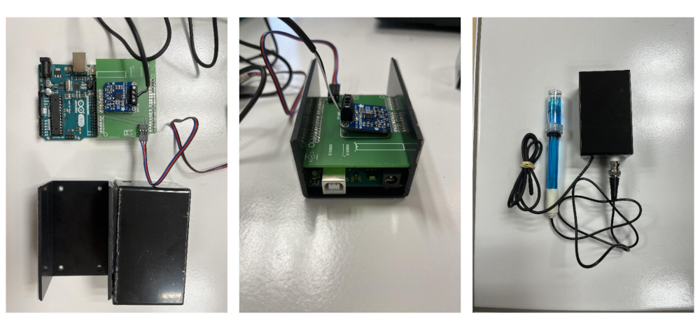
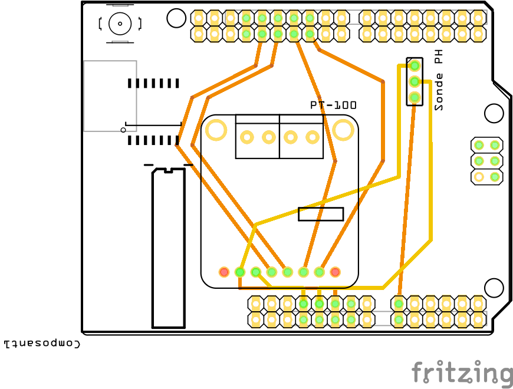

# SAFE-M-PH: un pH-mètre low cost pour l'enseignement

* [Introduction](##introduction)
* [L'appareil](##appareil)
* [Scripts](##arduino-scripts)
* [Programme python](##python)

## Introduction 

* Ce programme permet de contrôler un ph-mètre arduino équipé d'une sonde de température PT100.
* Il résulte d'un travail collectif effectué par des étudiants de Licence 3 de l'Institut de physique du globe de Paris.
* Il est distribué sous la licence créative common CC-by-SA 4.0
* Pour le citer:
Chardon, T., Gauthier-Brouard, T., Lu, C., Palmieri, C., de Singly, V., Lumembe, O., Métivier, F.,  Baugas-Villers, O., Bijon, V., Charles-Nicolas, A., Chin, C., Fossaert, H., Hallé, S., Henry-Gonzalez, M., Le Liorzou, C., Leroy, L., Marchaland Le Bihan, S., Monti, V., Pasquet, T., Perrenx, L., Poirier, M., Sauvage, D., Sookwhan, N., & Thommy, G. (2024). SAFE-M-PH Un pH-mètre low cost pour l'enseignement [Computer software]. https://github.com/fmetivier/pH_meter_V2.0

## L'appareil 

Le principe de l'appareil reprend les spécification de DFROBOT https://wiki.dfrobot.com/PH_meter%28SKU__SEN0161%29 .
Deux ajouts sont effectués afin d'améliorer la précision:

* une sonde de température PT100 a été ajoutée afin de corriger, partiellement, de l'effet de la température;
* la calibration du pH mètre est effectuée et contrôlée par le programme Python.

Les sondes pH sont reliées à l'arduino via un amplificateur de signal muni d'un portard permettant de régler la gamme de tension. Tous les pH-mètre ont été réglé afin de pouvoir mesurer des solutions avec des pH d'au moins 2. à cette fin la vis de règlage est ajustée afin que l'électrode plongée dans une solution tampon de pH = 2 donne un voltage de 240 mV environ.

Le montage est effectué au moyen d'une carte PCB dessinée avec Fritzing 
<!--  -->

## Script Arduino 

Le script arduino est simple et consiste uniquement à demander à l'appareil d'effectuer des mesures à une fréquence de 10Hz et les envoyer sur le port série. les mesures sont, d'une part, une mesure du voltage renvoyé par l'éléctrode pH et, d'autre part, une mesure de température renvoyée par la sonde PT100

## Programme Python 

La récupération, au moyen du port série, et l'analyse des données est effectuée au moyen d'un programme python. Pour fonctionner le programme nécessite, en plus des librairies standard l'installation des librairies suivantes: numpy, scipy, matplotlib, sklearn.

Pour des raisons de simplicité le script fonctionne en mode terminal, pas d'interface utilisateur graphique donc, et offre des choix à l'étudiant. Le programme permet

* une calibration à deux (4,7) ou trois (4,7,10) tampon;
* la réutilisation d'une calibration passée;
* l'usage d'une calibration par défaut obtenue grace à une série longue de mesures;
* la mesure du pH en continu;
* la représentation graphique des données.

Calibrations et mesures sont enregistrées en continu dans des dossiers CALIB et DATA, ce qui permet leur réutilisaiton ultérieure. La compensation de température est, pour l'heure, appliquée à la calibration uniquement.